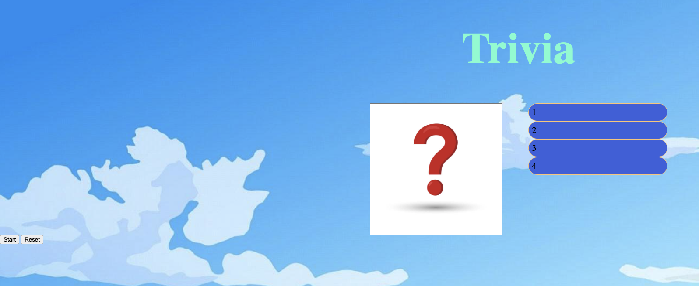

# Mackenzie Lamour SEI- Project 1- Trivia Game 

# Game Description
Trivia is a type of game in which players (who can play individually or in a team) are asked questions about different topics and they have to get as many correct answers as possible. Trivia contests are usually organized as part of events, parties and as pub entertainment. Normally contestants are organized in teams and the team who gets the higher score wins.

# Game imgs:

The picture above will be what the player first see's when they first start the game, the game will not start until the player clicks on start button. 

The picture below is a sample question that will be randomaly selected when the an answer has been selected or resets the game (manually)

# Technolgy used: 
HTML was the bases of getting the proper layout to ensure that the sqaure contanier, buttons (start and reset), the header, and the answer tabs were bulit. JS was used to ensure that the functions of the game were called. Pretty much what we tell the computer to do and how. The CSS is the degsin piece that gives the background colors, text size, the background image, and sqaure box image life. 

# Challege Code:

This code pictured abvoe has been most challeging to wrap my head around. This has given me better understanding of how to structure code but also has given me the hardest time in figuring out. Console logging was very key to figuring out where I was going wrong

# Link to Game:
https://maclamour.github.io/project1-Trivia/
# Next Steps; 

There was a lot that I wanted to do to make this game more interactive, fun, and visually appealing. I was also not able to get my reset button to work so that was a bummer. I hope that as I gain more experience, I am able to go back into this game and completely redo it. It will be a good gauge of where I started as a brand new coder to how much I was able to learn after this course is completed. 